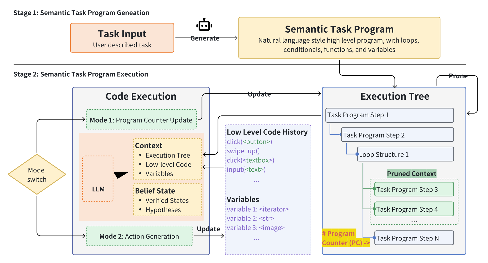

# AgentProg: Empowering Long-Horizon GUI Agents with Program-Guided Context Management 

<p align="center">
| <a href="https://arxiv.org/pdf/2512.10371"><b>📑 Paper</b></a> |
</p>

AgentProg is a novel framework that tackles the critical bottleneck of context management in long-horizon GUI automation. Traditional agents struggle with ever-expanding interaction histories, leading to context overflow and loss of critical information. AgentProg reframes this challenge by representing the agent's execution as a **structured program** with explicit variables and control flow, providing a principled mechanism to retain essential information while discarding irrelevant details.



## 🌟 Key Features

### 📝 Semantic Task Program (STP)
AgentProg provides Semantic Task Program, a semantic-tolerant domain-specific language that bridges rigid programming and flexible natural language:
- **Structured Control Flow**: Organizes complex tasks using loops, conditionals, and functions
- **Explicit Variables**: Captures and maintains critical information (e.g., task lists, user data) throughout execution through explicit variable declarations
- **Semantic Tolerance**: Uses natural language instructions that adapt to different environments, unlike brittle traditional scripts

### ⚙️ Flexible Program Execution
AgentProg interprets high-level program instructions into executable low-level actions:
- **Dual-Mode Execution**: Alternates between (1) generating Python code for GUI actions based on current program instruction and environment state, and (2) updating the Program Counter (PC) to control execution flow
- **Runtime Adaptation**: Translates abstract natural language instructions (e.g., "get user name") into concrete API calls (e.g., `click()`, `input()`, `swipe()`) based on real-time GUI observations
- **Decoupled Logic**: Separates task planning from execution details, preventing context overflow while maintaining flexibility to handle dynamic environments

### 🎯 Program-Guided Context Management
AgentProg intelligently manages agent context through program structure:
- **Control Flow Pruning**: Discards irrelevant branches, completed loop iterations and details of function invocation using execution tree structure
- **Data Flow Persistence**: Preserves task-critical information through explicit variable declarations
- **Step-Aware Retrieval**: Recalls previous executions of the same program step to improve consistency in repetitive tasks

### 🧠 Global Belief State
AgentProg addresses partial observability and environmental dynamics in GUI environments:
- **Active Monitoring**: Maintains hypotheses about hidden UI states (clipboard content, navigation stack, off-screen elements)
- **Runtime Verification**: Continuously validates assumptions against real-time observations
- **Anomaly Recovery**: Detects belief-reality gaps and triggers corrective actions (e.g., app crashes, form submission failure)

## 💡 Example

**Task: ContactsAddMultipleContactsAndSms**

Task description:

```
For the following persons:
Name: Hana Ferreira, Number: +10662908339
Name: Sophie Martin, Number: +18723713947
Name: Olivia Alves, Number: +16278036185, 
add them as new contacts, and then use Simple SMS Messenger to send each of them a  'hello, [Name]' message, where [Name] is the name of each contact.
```

Video (accelerated):

https://github.com/user-attachments/assets/1cd20e7d-5399-4289-b869-bdafd815d8c1

## 🚀 Getting Started

Set up the `agentprog` package:
```
git clone https://github.com/MobileLLM/AgentProg.git
cd AgentProg
pip install -e .
```

Python 3.11+ is recommended for running the agent.

Copy `.env.example` to `.env`, and set the Gemini API key and base URL in `.env`:

```
GEMINI_API_KEY=<YOUR_API_KEY_HERE>
```

Prepare an Android phone or Android emulator and connect it using adb.

For CLI usage:
```
agentprog [task requirements] --serial [serial name, e.g., emulator-5554]
```

For example:
```
agentprog "create a new contact named agent prog in contacts app." --serial emulator-5554
```

You can also use AgentProg in Python:

```python
from agentprog import agentprog_pipeline, AgentProgConfig
config = AgentProgConfig(task_description="create a new contact named agent prog in contacts app.", serial="emulator-5554")
agentprog_pipeline(config)
```

## 📄 Citation
```bibtex
@misc{tian2025agentprog,
      title={AgentProg: Empowering Long-Horizon GUI Agents with Program-Guided Context Management}, 
      author={Shizuo Tian and Hao Wen and Yuxuan Chen and Jiacheng Liu and Shanhui Zhao and Guohong Liu and Ju Ren and Yunxin Liu and Yuanchun Li},
      year={2025},
      eprint={2512.10371},
      archivePrefix={arXiv},
      primaryClass={cs.AI},
      url={https://arxiv.org/abs/2512.10371}, 
}
```
